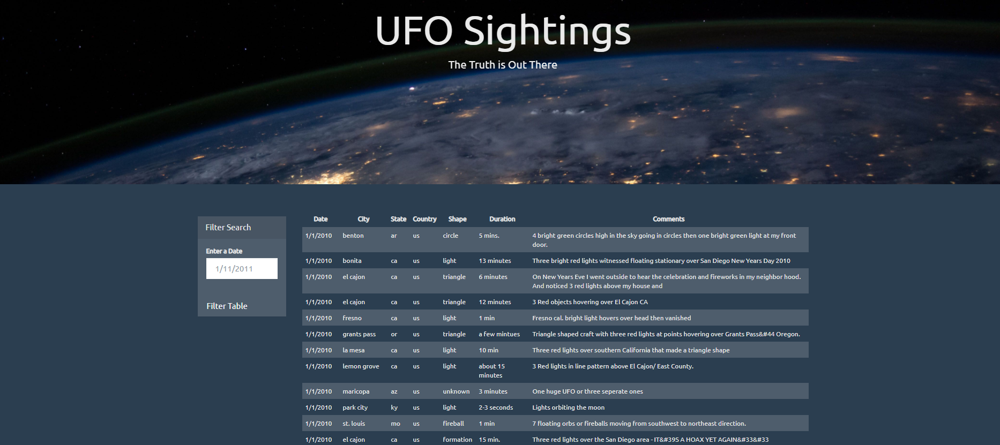
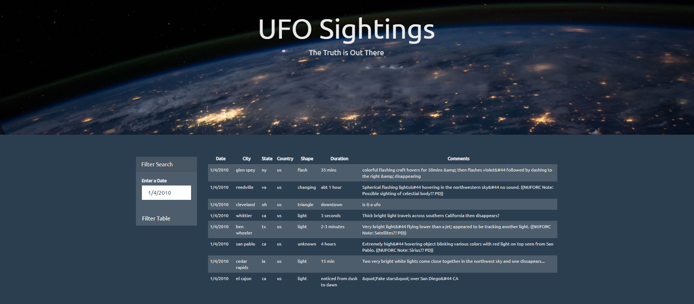

# Javascript-Filter_for_UFO_Sightings
Using the [UFO dataset](Static/js/data.js) (provided in the form of an array of JavaScript objects) this [script](Static/js/app.js) appends a table detailing the `date/time`, `city`, `state`, `country`, `shape`, and `comment` to the web page and then adds new rows of data for each UFO sighting. This web page also listens for events to search through the `date/time` column to find rows that match user input.
- - -
### Tech Stack
* JavaScript
* CSS
* HTML

### User Instructions
* Clone the repository: git clone https://github.com/DarrylB32/Javascript-Filter_for_UFO_Sightings
*  In command: python -m http.server 
*  In web browser: http://localhost:8000/

*  Search dates between Jan. 1, 2010 and Jan. 13, 2010

 
### Additional Notes
Updates will be made to the script to allow input tags and/or select dropdowns. User will be able to set multiple filters and search for UFO sightings using the`date/time`, `city`, `state`, `country`, and `shape`.